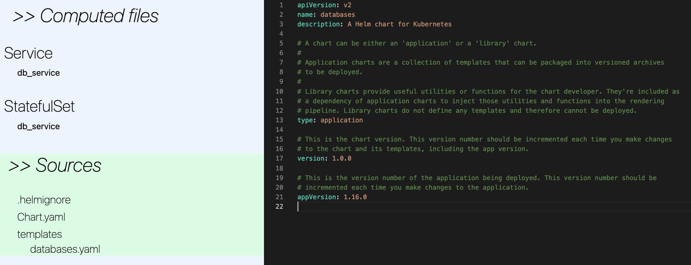

# helm-viewer

- NPM: [https://www.npmjs.com/package/helm-viewer](https://www.npmjs.com/package/helm-viewer)

## Motivation

When working with [Helm Charts](https://helm.sh/docs/topics/charts/), it is often helpful to generate the template and check the final result. The `helm template` command provided by Helm serves this purpose. However, the output of this command is a large block of raw text, making it cumbersome to analyze.

The helm-viewer project aims to provide a user-friendly tool for building Helm charts.

## Installation

```bash
# Install globally
npm i -g helm-viewer
```

## Usage

```bash
# Run in a Helm chart folder
helm-viewer

# Specify a specific path
helm-viewer path/to/the/chart
```

Running the command will analyze the Helm chart and generate an HTML report, which will be automatically opened in your default web browser.



# Development
## Generate the binary

To generate the binary for the helm-viewer project, we use the `just` command, which is a task runner tool. It helps streamline various development tasks and automates common actions.

The `just` command in this project is configured to perform the necessary steps to generate the binary for helm-viewer. This ensures that the project can be easily built and distributed to users.

To use the `just` command, you'll need to have it installed on your system. You can download it from the official GitHub repository:

- GitHub: [https://github.com/casey/just](https://github.com/casey/just)

Make sure to follow the installation instructions provided in the `just` repository's documentation for your specific operating system.

Once you have `just` installed, generating the binary is as simple as running the following command:

```bash
just
```

This will execute the predefined tasks and generate the binary file required for running the helm-viewer tool.
